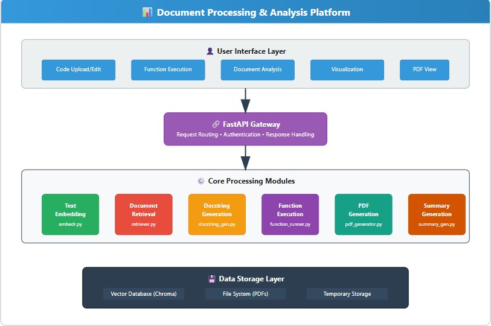

# 🤖 AI Code Insight Assistant

A powerful, LLM-driven platform that allows developers to **understand**, **document**, **visualize**, and **interact** with their codebase intelligently.

Supports **Python**, **JavaScript**, and **Java** projects with features like:
- 🔍 Semantic search and Q&A
- 🧾 Automatic docstring generation
- 📄 Code summary tutorial PDF creation
- 🎨 Code structure visualization (Mermaid diagrams)
- ⚙️ Function execution with input/output
- 📈 Business logic impact analysis on code changes

---

## 🧩 Architecture Overview



> *Each module (Embedder, Summarizer, Executor, etc.) is designed independently with FastAPI micro-routes and React-driven UI.*

---

## 🚀 Features

| Module         | Description |
|----------------|-------------|
| `Embedder`     | Embeds codebase files into vector DB using OpenAI embeddings |
| `QA`           | Semantic search + LLM answers from code |
| `Docstring`    | Generates missing docstrings in Python/JS/Java |
| `PDF Generator`| Summarizes code into a navigable tutorial PDF |
| `Executor`     | Executes functions with parameters and returns results |
| `Visualizer`   | Class, flow, and dependency diagrams via Mermaid |
| `Impact Analyzer` | Identifies business logic changes between original and updated code |

---

## 🛠 How to Run the App

### 🔧 Backend Setup (FastAPI)

```bash
cd backend
python -m venv venv
source venv/bin/activate         # Or venv\Scripts\activate on Windows
pip install -r requirements.txt
uvicorn main:app --reload
```

- OpenAPI Docs: http://localhost:8000/docs  
- Environment: Set `OPENAI_API_KEY` in `.env` or system env

---

### 🌐 Frontend Setup (React + Tailwind)

```bash
cd frontend
npm install
npm run dev
```

- Open in browser: http://localhost:5173

---

### 📁 Folder Structure

```txt
backend/
├── api/routes/
│   ├── embedder_api.py
│   ├── qa_api.py
│   ├── pdf_api.py
│   ├── executor_api.py
│   ├── visualizer_api.py
│   ├── docstring_api.py
│   └── summarizer_api.py
├── modules/
│   ├── embedder.py
│   ├── retriever.py
│   ├── executor.py
│   ├── docstring_generator.py
│   ├── diagram_generator.py
│   ├── summary_generator.py
│   └── pdf_generator.py
└── main.py

frontend/
├── src/
│   ├── components/
│   ├── pages/
│   ├── styles/
│   ├── App.jsx
│   └── main.jsx
└── public/
```

---

## 👥 Contributors

| Name           | 
|----------------|
| Harini Ganeshan| 
| Mitali Laroia  |

---

## 📜 License

MIT License.  
This project uses OpenAI APIs and must comply with their terms of use.
